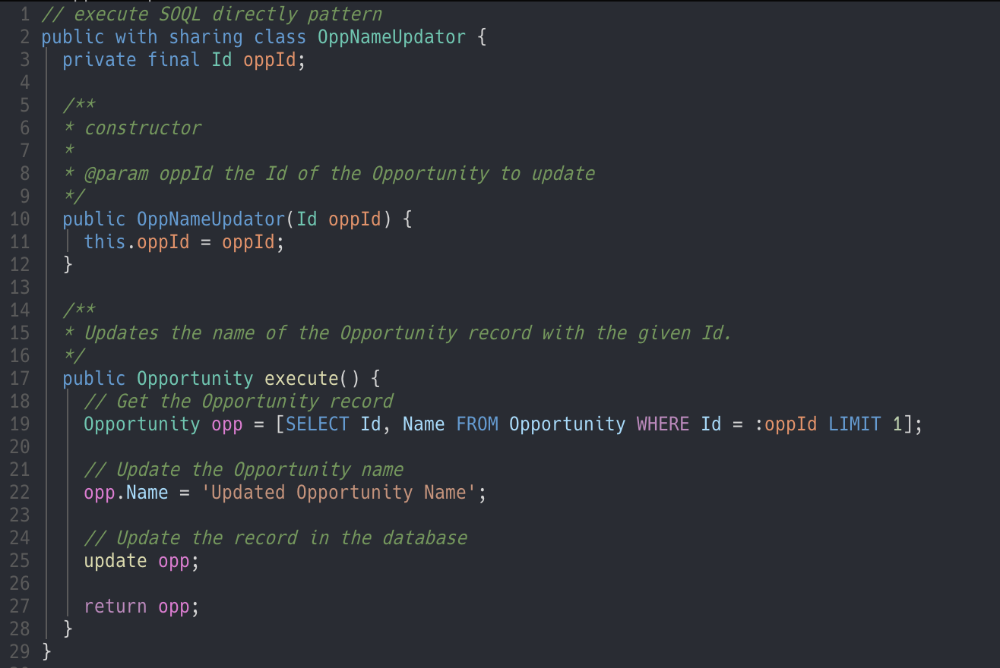
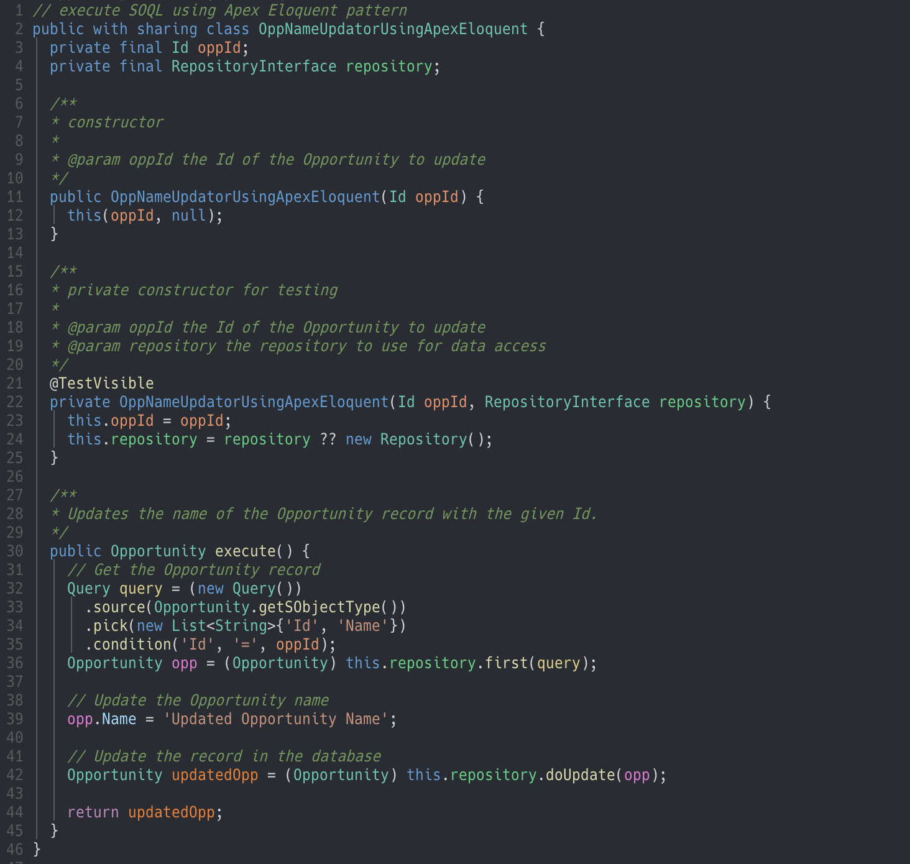
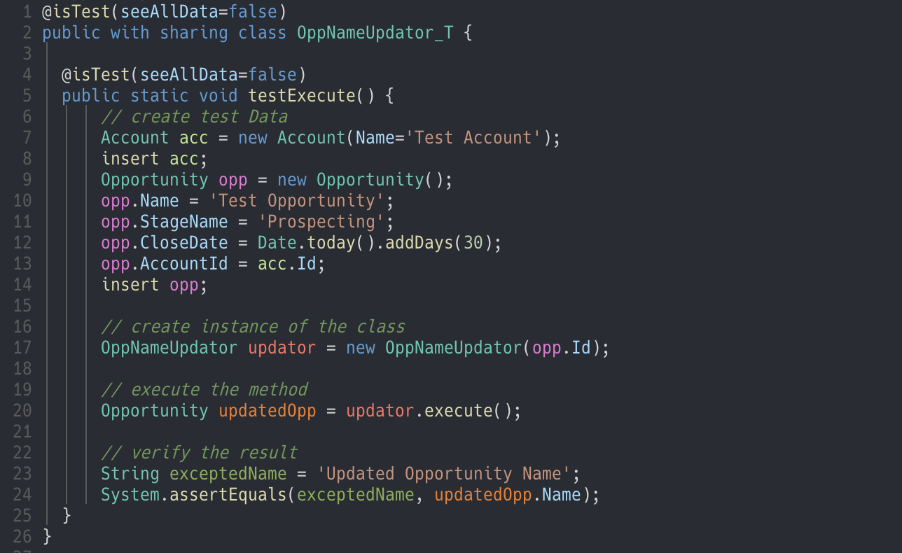
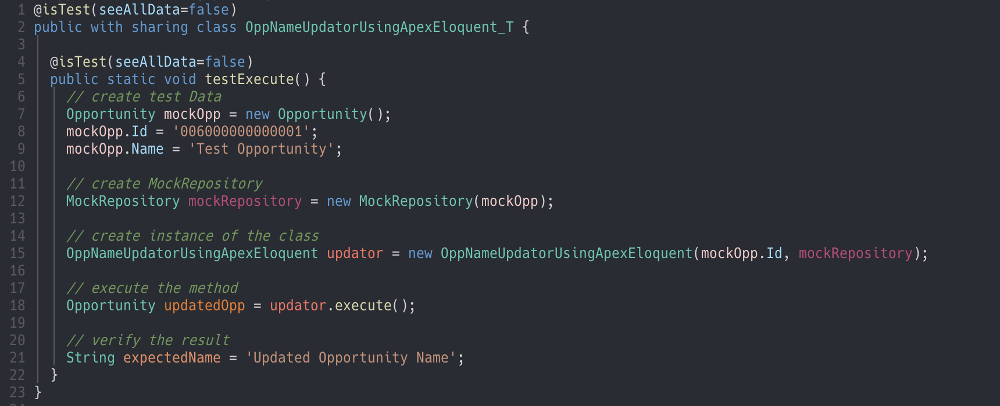

# What is Apex Eloquent 

Apex Eloquent is a framework that enables database operations in Apex similar to Laravel's Eloquent.
This brings the following advantages:

- **Improved readability**: No need to construct SOQL queries as strings, enhancing readability.

- **Dynamic query generation**: Allows flexible addition of conditions.

- **Better testability**: Adopting the repository pattern reduces database dependency during testing.

- **Improved type safety**: Enables IDE autocomplete for variables.

# What's the difference from other SOQL builder ?
What differentiates Apex Eloquent from other SOQL builder is using `Repository pattern`.

The repository pattern brings testability to your projects.

Furthermore, Apex Eloquent has Mock Repository as standard, so you don't need to prepare a Mock class.

# Issues with Database Operations in Apex

### Writing Queries in Apex

#### 1. Constructing SOQL as a String and Executing It
```apex
String soql = 'SELECT ID, Name FROM Opportunity WHERE ID = :oppId AND .......';
Opportunity opp = Database.query(soql);
```

#### 2. Directly Writing the Query
```apex
Opportunity opp = [SELECT ID, Name From Opportunity WHERE ID = :oppId AND .......];
```

### Problems with These Query Methods
1. When constructing queries as strings, formatting cannot be applied, making long queries difficult to read.
1. If you want to add conditions dynamically:
    1. When using strings, you need to manipulate the string, making it hard to generalize and cumbersome to modify conditions.
    1. When writing queries directly, this is not possible.
1. Writing queries as strings does not allow IDE autocomplete for variables.
2. `FIELDS(ALL)` as `SELECT *` cannot be used in Apex
1. In both methods, variables cannot be used in the SELECT clause.
1. Writing test classes always requires database dependencies, meaning test data must be inserted.
    1. As the number of test target classes increases, test execution time becomes longer.

Apex Eloquent solves all these issues.


# Installation 

## 1. Prepare install tool
Using `Make` for installing Apex Eloquent to your project.
If you have already install `Make`, below command show make version.
Make version is not shown, you have to install Make.
```
$ make -v
GNU Make 4.3
```

## 2. Get Apex Eloquent
Pull ApexEloquent using `git submodule` command.
```
$ cd force-app/main/default/classes

$ git submodule add https://github.com/krile136/ApexEloquent.git ApexEloquent
```

## 3. Deploy to your org
Deploy ApexEloquent using `make install` command.
```
$ make install
```

Test classes are written to meet the 75% code coverage requirement using standard fields of standard objects, so deployment should work without modifications. However, if tests fail, please maintain the test classes accordingly.

# Update ApexEloquent

Execute below command in your project root directory.
```
$ cd force-app/main/default/classes/ApexEloquent

$ git pull

$ make install
```


# Usage
Here are two patterns for the class that updates opportunity.
One that issues SOQL directly, and one that uses Apex Eloquent.
|Using SOQL directly|Using Apex Eloquent|
|:---:|:---:|
|||

# Writting test

In `Usage example`, Apex Eloquent increases the amount of description and makes it easier to read when the query becomes somewhat complex.

However, the real power of Apex Eloquent is in test classes.

|Using SOQL directly Test|Using Apex Eloquent Test|
|:---:|:---:|
|||

Both tests are passed, but using SOQL Directly test needs inserting test data to database.

Using Apex Eloquent Test does not need inserting test data, only create test target object.

Opportunity have only one dependency of Account, but if class needs object that have complex dependency, writting test class will become penance.

The Repository pattern frees you from these dependencies and makes it easier to write tests.

# Testing Cycle
What's even better about Apex Eloquent is that the tests take less time to run.
|ms|Using SOQL directly Test|Using Apex Eloquent Test|
|:---:|:---:|:---:|
|1|296|66|
|2|225|71|
|3|345|58|
|4|333|63|
|5|238|64|

This comparison is due to freshly created environments.

In a real project, the difference in execution time will likely be even larger due to dependencies, triggers and other factors.

By writing test classes using Apex Eloquent, you can speed up the logic validation cycle.

# Methods

## Query Class

### **source**

Specify the `FROM` clause in SOQL.
```apex
(new Query()).source(Opportunity.getSObjectType());
```

### pick

Specify the `SELECT` clause in SOQL.
```apex
List<String> fields = new List<String>{Name, CloseDate};
(new Query()).pick('Id').pick(fields);
```

### withParent

Add relation(parent) to SELECT And WHERE clause.

The relation name is automatically determined from the relation field name, so there is no need to look it up.
```apex
(new Query())
    .source(Opportunity.getSObjectType())
    .pick('Id')
    .withParents(new ParentClause('AccountId', (new Query()).pick('Name').pick('Id').condition('Name', '=', 'testAccount')))
    .condition('Name', '=', 'testOpportunity');

// SELECT Id, Account.Name, Account.Id FROM Opportunity WHERE (Name = 'testOpportunity' AND Account.Name = 'testAccount')
```

WithParent method can write without ParentClause.
```apex
(new Query())
    .source(Opportunity.getSObjectType())
    .pick('Id')
    .withParents('AccountId', (new Query()).pick('Name').pick('Id').condition('Name', '=', 'testAccount'))
    .condition('Name', '=', 'testOpportunity');

// SELECT Id, Account.Name, Account.Id FROM Opportunity WHERE (Name = 'testOpportunity' AND Account.Name = 'testAccount')
```

### withChildren
Add Relation(children) to SELECT clause.

Plural or child object names with `__r` are automatically generated from source, so you don't need to look them up.
```apex
(new Query())
    .source(Account.getSObjectType())
    .pick('Id')
    .withChildren((new Query())
        .source(Opportunity.getSObjectType())
        .pick('Name')
        .isNotNull('Name')
    );
// SELECT Id, (SELECT Name From Opportunities WHERE (Name != NULL))
```

### condition

Specify the `WHERE` clause in SOQL

In the case of orCondition, you can add OR conditions.
```apex
(new Query()).source(Opportunity.getSObjectType()).pick('Id').condition('Name', '=', 'test');
// SELECT Id FROM Opportunity WHERE Name = 'test'

List<Id> oppIds = new List<Id>{'006000000000000', '006000000000001'};
(new Query()).source(Opportunity.getSObjectType()).pick('Id').condition('Id', 'IN', oppIds);
// SELECT Id FROM Opportunity WHERE Id IN (006000000000000, 006000000000001) 


(new Query())
    .source(Opportunity.getSObjectType())
    .pick('Id')
    .condition('Name', '=', 'test')
    .condition('Id', 'IN', (new Query())
        .condition('CloseDate', '>=', Date.newInstance(2024, 1, 1) 
        .condition('CloseDate', '<=', Date.newInstance(2024, 12, 31) 
    );
// SELECT Id FROM Opportunity WHERE Name = 'test' AND (CloseDate >= 2024-01-01 AND CloseDate <= 2024-12-31)
```

### join

You can add filtering conditions for another table using subqueries.

Note: While this example uses the term "join," it refers to SOQL's ability to filter related records using subqueries, which is conceptually similar to SQL joins but implemented differently.
```apex
(new Query())
    .source(Opportunity.getSObjectType())
    .pick('Id')
    .condition('Name', '=', 'test')
    .join('AccountId', 'IN', (new Query())
        .source(Account.getSObjectType())
        .pick('Id')
        .condition('Name', '=', 'testAccount')
    );
// SELECT Id FROM Opportunity WHERE Name = 'test' AND AccountId IN (SELECT Id FROM Account WHERE Name = 'testAccount')
```

### orderBy

Specify the `ORDER BY` clause in SOQL

```apex
(new Query())
    .source(Opportunity.getSObjectType())
    .pick('Id')
    .orderBy('CloseDate');
// SELECT Id FROM Opportunity ORDER BY ASC 
```

You can fully configure ORDER BY by passing up to three arguments.
```apex
(new Query())
    .source(Opportunity.getSObjectType())
    .pick('Id')
    .orderBy('CloseDate', 'DESC', 'LAST');
// SELECT Id FROM Opportunity ORDER BY DESC NULLS LAST
```

### restrict

Specify the `LIMIT` clause in SOQL
```apex
(new Query())
    .source(Opportunity.getSObjectType())
    .pick('Id')
    .restrict(20);
// SELECT Id FROM Opportunity LIMIT 20
```

## Repository Class

By passing the Query class, you can retrieve data, and by passing SObject to methods such as doInsert, you can insert data into the database.

### get

Executes SOQL and retrieves the results.

The return value is `List<SObject>`, so cast it to the appropriate object type.

If the number of retrieved records is 0, an empty array is returned.
```apex
List<Opportunity> opps = (List<Opportunity>) (new Repository()).get(query);
```

### getOrFail

Executes SOQL and retrieves the results.

The return value is `List<SObject>`, so cast it to the appropriate object type.

If the number of retrieved records is 0, an error is thrown.
```apex
try {
    List<Opportunity> opps = (List<Opportunity>) (new Repository()).getOrFail(query);
} catch(Exception e){
    // handling error
}
```

### first

Executes SOQL and returns the first record from the results.

If the number of retrieved records is 0, `null` is returned.
```apex
Opportunity opp = (Opportunity) (new Repository()).first(query);
```

### firstOrFail

Executes SOQL and returns the first record from the results.

If the number of retrieved records is 0, an error is thrown.
```apex
try { 
    Opportunity opp = (Opportunity) (new Repository()).first(query);
} catch(Exception e) {
    // handling error 
}
```

### doInsert

Inserts the SObject passed as an argument into the database.

The return value is the record with the ID added after insertion.
```apex
insertOpp = (new Repository()).doInsert(insertOpp);
System.debug(insertOpp.Id)  // show opp id
```
You can also insert arrays in the same way.
```apex
insertOpps = (List<Opportunity>) (new Repository()).doInsert(insertOpps);
```

### doUpdate

Updates the SObject passed as an argument.
```apex
updateOpp = (new Repository()).doUpdate(insertOpp);
```
You can also update arrays in the same way.
```apex
updateOpps = (List<Opportunity>) (new Repository()).doUpdate(updateOpps);
```

## doDelete
Deletes the SObject passed as an argument.
``` apex
(new Repository()).doDelete(deleteOpp);
```
You can also delete arrays in the same way.
```apex
(new Repository()).doDelete(deleteOpps);
```

# Recipes

## Want to do SELECT * 
Use pickAll
```apex
    Query query = (new Query())
      .source(Opportunity.getSObjectType())
      .pickAll()
      .find(oppId)
```

## Want to add a WHERE clause with specific conditions

You can flexibly build queries using methods in the query.
```apex
// Condition to get a list of opportunities owned by an account
Query query = (new Query())
    .source(Opportunity.getSObjectType())
    .pickAll()
    .condition('AccountId', '=', account.Id);

// If the account type is 'Customer - Direct', add a condition for 'New Customer' in the opportunity type
if(Account.Type == 'Customer - Direct') {
    query.condition('Type', '=', 'New Customer');
}

// Retrieve opportunities
List<Opportunity> opps = (List<Opportunity>) (new Repository()).get(query);
```

## Many SELECTs and WHEREs
Using a formatter makes it easier to read by aligning vertically.
```apex
    Query query = (new Query())
      .source(Opportunity.getSObjectType())
      .pick('hoge')
      .pick('huga')
      ..
      ..
      ..
      .condition('A', '=', 1)
      .condition('B', '=', 2)
      ..
      ..
      ..
```
